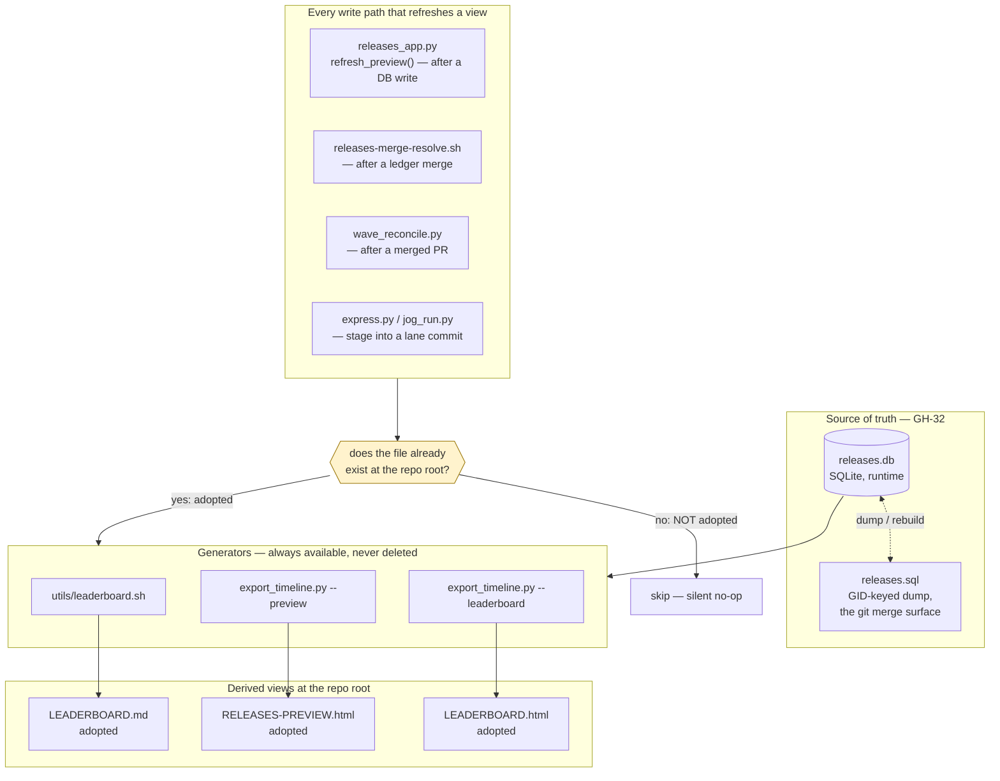

# Relay Architecture

For XYZ’s product purpose, see [Guiding Principles](GUIDING-PRINCIPLES.md#purpose).
[ROUTER’s role split](ROUTER.md#role-split) separates XYZ policy from PDDA-layer governance.

The relay is a process supervisor around a shared `tick` task, not an in-process multi-agent API.

That distinction matters: Claude does not call Codex or agy as functions. The system shells out to
each model's own CLI in a separate subprocess, one turn at a time, and coordinates them through two
shared artifacts on disk:

- the `RELAY-TURN` task in `tick`, which answers "whose turn is it?"
- the relay thread Markdown file, which holds the human-readable review state

## Skills Index

One-line pointer to every skill in `skills/`. Follow the link to a skill's `SKILL.md` for its
full trigger conditions and usage — this table exists so a task can be routed to the right skill
without reading all of them first.

| Skill | Purpose |
|---|---|
| [10days](skills/10days/SKILL.md) | Sweep recent GitHub issues, verify still-valid, build a marathon plan from survivors. |
| [agent-chorus](skills/agent-chorus/SKILL.md) | Start/join a local multi-agent discussion thread over a six-digit ID (AgentChorus, formerly Agent2Agent). |
| [ate](skills/ate/SKILL.md) | Drive bounded, unattended variation-test matrices and roll findings into one issue. |
| [better-options](skills/better-options/SKILL.md) | Falsify the apparent option set, then surface smaller viable alternatives. |
| [ci-doctor](skills/ci-doctor/SKILL.md) | Diagnose CI health and benchmark `runs-on`/config variants side by side. |
| [consult](skills/consult/SKILL.md) | One-shot cross-model second opinion (Codex + agy in parallel), reconciled. |
| [debug-mantra](skills/debug-mantra/SKILL.md) | Debug by reproducing, tracing the fail path, falsifying, and cross-referencing evidence. |
| [express](skills/express/SKILL.md) | Hotfix fast lane — one motion: fix + suite, ledger writes, born-complete docs, gateless development landing, reconcile. |
| [feynman](skills/feynman/SKILL.md) | Translate dense technical material into accurate, layered plain language. |
| [file-xyz-bug](skills/file-xyz-bug/SKILL.md) | File a bug against the xyz harness from any repo/session. |
| [five](skills/five/SKILL.md) | 5-and-5 decision checksum over a plan/feature/fix — five load-bearing decisions + five explicit non-goals, each cited. |
| [front-door](skills/front-door/SKILL.md) | Audit whether a newcomer can actually go from clone to working install. |
| [github-auth-debug](skills/github-auth-debug/SKILL.md) | Diagnose the macOS split where git authentication works but `gh` fails. |
| [honest](skills/honest/SKILL.md) | Produce a defensible ground-truth assessment of repository maturity and claims. |
| [hq](skills/hq/SKILL.md) | Multi-repo command center — resolve a project name and act across repos. |
| [install-improve-audit](skills/install-improve-audit/SKILL.md) | Get an unfamiliar repository building, fix blockers, and open a bounded PR. |
| [jog](skills/jog/SKILL.md) | Capture and execute an immediate serial task queue one item at a time. |
| [marathon-cleanup](skills/marathon-cleanup/SKILL.md) | Audit and archive completed PDDA marathon plans/bundles. |
| [marathon-triage](skills/marathon-triage/SKILL.md) | Triage intake into a ranked, preflight-checked marathon candidate queue. |
| [open-router](skills/open-router/SKILL.md) | Resolve a colloquial model name to its canonical OpenRouter slug. |
| [phase-qa](skills/phase-qa/SKILL.md) | Add phase-appropriate QA checks to plans and review completed phases. |
| [ponytail](skills/ponytail/SKILL.md) | Forces the simplest/minimal solution (YAGNI lens) for a given change. |
| [radar](skills/radar/SKILL.md) | Per-repo strategic compass — Run/Grow/Transform flow, defect clustering. |
| [read-only](skills/read-only/SKILL.md) | Add a narrow read-only command allowlist to Claude Code settings. |
| [readme-audit](skills/readme-audit/SKILL.md) | Audit a README as both user-facing artifact and map of the repo's docs. |
| [recon](skills/recon/SKILL.md) | Trace an existing system end to end before planning a change. |
| [relay](skills/relay/SKILL.md) | Scaffold and run the portable file-based Producer/Reviewer protocol. |
| [relay-automation](skills/relay-automation/SKILL.md) | Tick-backed automation library behind the `/relay` review loop. |
| [relay-to-issue](skills/relay-to-issue/SKILL.md) | Turn a finished relay thread into a checklist-style GitHub issue. |
| [relay-xyz](skills/relay-xyz/SKILL.md) | Drive an automated relay review loop with the shipped harness. |
| [releases](skills/releases/SKILL.md) | Read/author/publish the releases.db planning ledger. |
| [review-xyz](skills/review-xyz/SKILL.md) | Multi-model, worktree-isolated code review; posts to GitHub PRs. |
| [rpr](skills/rpr/SKILL.md) | Generalize recent permission prompts into narrow local allowlist rules. |
| [shakedown](skills/shakedown/SKILL.md) | Audit script-calling skills across CWD, install, symlink, and permission scenarios. |
| [skills-army-hq](skills/skills-army-hq/SKILL.md) | Manage durable local skill copies, a catalog, backups and owned global app symlinks. |
| [spike-360](skills/spike-360/SKILL.md) | Interrogate authority before introducing or moving a source of truth. |
| [start-task](skills/start-task/SKILL.md) | Carry one or more issues through governed intake, grounded planning, relay QA, execution, and ready PRs. |
| [standup](skills/standup/SKILL.md) | Session-scoped triage — what's open, rotting, or off-plan. |
| [swe](skills/swe/SKILL.md) | Software-engineering governance lens for build/spec/PRD docs. |
| [swe-diagram](skills/swe-diagram/SKILL.md) | Generate interactive architecture and Git-history diagrams from local evidence. |
| [triangulate](skills/triangulate/SKILL.md) | Reconcile three independent probes into an evidence-ranked verdict. |
| [vendor-stack](skills/vendor-stack/SKILL.md) | Install the XYZ harness + optional PDDA runtime into a target repo. |
| [vscode-color](skills/vscode-color/SKILL.md) | Assign a stable per-repository VS Code workspace tint. |
| [weekly-shipped](skills/weekly-shipped/SKILL.md) | Summarize what shipped to main over the last week, user-impact framed. |
| [xyz](skills/xyz/SKILL.md) | Coordinate concurrent agents on non-overlapping lanes via `tick`. |

## Verified Scope

This document is based on the current code in:

- [relay-automation/relay-drive.sh](relay-automation/relay-drive.sh)
- [relay-automation/relay-turn-lib.sh](relay-automation/relay-turn-lib.sh)
- [relay-automation/claude-turn.sh](relay-automation/claude-turn.sh)
- [relay-automation/codex-turn.sh](relay-automation/codex-turn.sh)
- [relay-automation/agy-turn.sh](relay-automation/agy-turn.sh)
- [relay-automation/poll.sh](relay-automation/poll.sh)
- [bin/tick](bin/tick)

Where a behavior is only described in comments or operator notes, this doc says so explicitly.

## Stack Model

There are five load-bearing layers:

```text
relay-drive.sh
  supervisor loop; reads tick + thread status, picks the active actor, invokes one shim

codex-turn.sh / agy-turn.sh / claude-turn.sh
  per-agent dispatch shims; "is it my turn?", build prompt, run CLI, enforce containment

relay-turn-lib.sh
  shared safety core; allowlist, worktree isolation, timeout watchdog, scoped commit

RELAY-TURN (tick task)
  the turn pointer; claim / ping / release --to / done

relay-system/<date>/<slug>.md
  the thread file; STATUS and review blocks, but not the source of turn ownership
```

Nobody imports anybody. The architecture is shell processes spawning shell processes, with `tick`
projection and a Markdown thread file as the only shared state.

## What Decides Turn Order

The `RELAY-TURN` task is authoritative for turn ownership.

The driver reads `tick info <task>` and derives the current actor like this:

- `status: claimed` -> current actor is `claimer`
- `status: open` with `handoff-to` -> current actor is `handoff-to`
- anything else -> no live actor

That logic lives in [relay-automation/relay-drive.sh](relay-automation/relay-drive.sh) and matches
the fields printed by [bin/tick](bin/tick).

The thread file's `STATUS:` header is only the terminal signal:

- `Approved` or `Closed` means "the relay should stop"
- it does not decide whose turn is next

`relay-drive.sh` enforces agreement between the two:

- file terminal + token still live -> exit `4` (`close mismatch`)
- file non-terminal + token gone -> exit `4`
- token actor did not move after a turn -> exit `3` (`no progress`)

## How a Turn Is Invoked

Each headless turn follows the same pipeline:

1. `relay-drive.sh` reads the current `RELAY-TURN` actor and exports `RELAY_AGENT`,
   `RELAY_FILE`, and `RELAY_TASK`.
2. The selected shim checks whether `RELAY_AGENT` matches its configured agent id.
   If not, it exits `0` and defers.
3. The shim calls `rtl_init` and `rtl_turn_prompt` from
   [relay-automation/relay-turn-lib.sh](relay-automation/relay-turn-lib.sh).
4. The shim calls `rtl_before` to snapshot the pre-turn `HEAD` and the working-tree
   dirty set, so enforcement later acts only on changes this turn introduced. (Without
   it, `rtl_enforce` cannot distinguish the turn's edits from pre-existing ones and
   would reset `HEAD` and exit `6` on any change — see
   [agy-turn.sh:97](relay-automation/agy-turn.sh#L97),
   [codex-turn.sh:62](relay-automation/codex-turn.sh#L62),
   [claude-turn.sh:122](relay-automation/claude-turn.sh#L122).)
5. The shim runs the model CLI under `rtl_run_bounded`, a sleep-then-`kill -9` watchdog.
6. The shim calls `rtl_enforce`, which:
   - resets the repo if the agent committed during its turn
   - reverts off-allowlist tracked changes
   - stages only the allowlist
   - creates one file-scoped commit
   - never pushes

### Actual CLI invocations

| Agent | Invocation built by the shim |
|---|---|
| Codex | `env -u OPENAI_API_KEY codex exec -s workspace-write "<prompt>"` by default |
| agy | `agy --dangerously-skip-permissions --print-timeout 300s [--model ...] -p "<prompt>"` |
| Claude | `claude -p "<prompt>" --model claude-sonnet-4-6 --allowedTools "Bash,Read,Edit,Write" --permission-mode acceptEdits --output-format json --max-turns 12 --max-budget-usd 0.50` |

Those defaults are configurable via environment variables in each shim, but the shape above is what
the current code assembles.

## Containment Model

The shared containment contract lives in `relay-turn-lib.sh`, not in the individual shims.

### 1. Path allowlist

Every turn is constrained to:

- the relay thread file
- any extra paths passed in `ALLOW_PATHS`

Reviewer turns are stricter. If the thread file's first `NEXT:` line names `Reviewer`,
`rtl_init` drops `ALLOW_PATHS` and limits the turn to the relay file only.

### 2. Commit-bypass guard

If the agent moves `HEAD` during its turn, `rtl_enforce` does a hard reset back to the pre-turn
commit and exits `6`.

That is an intentional destructive action, but only against commits the turn itself created.

### 3. File-scoped commit, no push

After enforcement, `rtl_enforce` stages only the allowlisted paths and creates a commit only if
there is a staged diff:

```text
relay(<task>): <agent> turn (<tool> headless; no push)
```

No shim pushes.

### 4. Timeout watchdog

`rtl_run_bounded <seconds> <cmd...>` is the wall-clock guard used by every shim.

- normal CLI failure -> returns the CLI's exit code
- watchdog kill -> returns `7`
- containment violation -> still wins; the turn exits `6`

### 5. Worktree isolation

Driven runs default to worktree isolation.

`relay-drive.sh` exports `RELAY_WORKTREE_ISOLATION=1` unless the operator explicitly overrides it.
When that flag is on:

- the shim creates a throwaway worktree at `ROOT@HEAD`
- the agent CLI runs with `cwd` set to that worktree
- `.tick` stays shared through `TICK_REPO_ROOT`
- only allowlisted files are copied back
- any off-lane edit in the worktree is discarded and the turn fails with exit `6`

This is why the normal architecture is stronger than a simple "run then revert" story: the default
supervised path isolates writes before enforcement runs.

Direct shim invocation is different: each leaf shim still treats worktree isolation as opt-in unless
the caller exports `RELAY_WORKTREE_ISOLATION=1`.

## The `tick` Token Lifecycle

The relay pointer is a normal `tick` task whose fields are projected by the kernel:

```text
tick claim   RELAY-TURN --agent codex --paths ...
tick ping    RELAY-TURN --agent codex
tick release RELAY-TURN --agent codex --to claude-a
tick done    RELAY-TURN --agent codex
```

In `tick info`, the supervisor reads:

```text
status:   open|claimed|done|...
claimer:  <agent>        # only when claimed
handoff-to: <agent>      # when an open task is reserved for the next actor
```

The important architectural point is that handoff is encoded in `tick` state, not inferred from
the thread file body.

### Foreign-CWD safety (GH-12)

The coordination-mutation verbs (`claim` / `take` / `scope` / `release` / `break` / `done` /
`ping` / `reap`) resolve the repo root as `TICK_REPO_ROOT` → `git rev-parse` → cwd. When that
root is *inferred* (not pinned via `TICK_REPO_ROOT`), `tick` echoes the resolved root to stderr
and **refuses** the verb if that repo has no `.tick/events` — so a mutating call from the wrong
working directory fails loudly instead of silently no-op'ing in (or auto-creating) the wrong
repo's log. Driven turns and the shims pin `TICK_REPO_ROOT` to the harness clone, so they stay on
the trusted path. Verified against [bin/tick](bin/tick); detail in
[PROJECT/3-COMPLETED/GH-12-TICK-FOREIGN-CWD-SILENT-NOOP.md](PROJECT/3-COMPLETED/GH-12-TICK-FOREIGN-CWD-SILENT-NOOP.md).

## Agent-Specific Behavior

### Codex shim

Verified behavior from [relay-automation/codex-turn.sh](relay-automation/codex-turn.sh):

- strips `OPENAI_API_KEY` unless `CODEX_ALLOW_API_KEY=1`
- defaults to `codex exec -s workspace-write`
- logs to a temp file
- does not capture token stats yet

Operational note from code comments, not runtime enforcement:

- the comments warn that Codex may need a looser approval/sandbox config on a fresh device

### agy shim

Verified behavior from [relay-automation/agy-turn.sh](relay-automation/agy-turn.sh):

- runs `agy -p` headlessly with `--dangerously-skip-permissions`
- pins `--print-timeout` to the same wall-clock limit used by the watchdog
- treats `exit 0` plus an empty log as a hard failure (`exit 5`)
- warns in cross-repo mode that agy resolves relative paths against process CWD, not `AGY_TURN_ROOT`

Operational consequence:

- cross-repo relay prompts may need absolute target paths inside the thread content for agy to find
  the right files

### Claude shim

Verified behavior from [relay-automation/claude-turn.sh](relay-automation/claude-turn.sh):

- pins the model, default `claude-sonnet-4-6`
- sets `--allowedTools "Bash,Read,Edit,Write"`
- blocks selected external commands by shadowing them on `PATH`
- captures token counts from JSON output and records them with `tick cost`

The PATH shadow is a guardrail, not a perfect sandbox. The code comments are explicit that an
absolute-path call could bypass it; worktree isolation is the stronger boundary.

## End-to-End Turn Example

```text
relay-drive.sh reads tick info RELAY-TURN
  -> actor = codex
  -> exports RELAY_AGENT=codex
  -> runs codex-turn.sh

codex-turn.sh
  -> confirms RELAY_AGENT matches CODEX_AGENT
  -> builds the shared prompt
  -> runs codex exec under rtl_run_bounded
  -> codex edits the relay file and uses ./bin/tick to ping/release or done
  -> rtl_enforce reverts off-lane changes, stages only the allowlist, commits, no push

relay-drive.sh
  -> re-reads RELAY-TURN
  -> if actor moved, continue
  -> if token is done and file STATUS is terminal, stop
```

The key invariant is simple: the model writes the review state and moves the token; the harness owns
containment and commits.

## Adjacent Drivers

`poll.sh` is not the turn-taker. It is a decision engine that answers whether to:

- run the runner
- run the watchdog
- idle
- stop
- nudge a non-Claude peer

In relay mode it uses the same split as `relay-drive.sh`:

- `tick` decides whose turn is runnable
- the relay file's `STATUS:` decides whether the loop is terminal

## Adjacent Subsystems

The GH-32 RELEASES ledger has its own authority split (SQLite at runtime, a GID-keyed SQL dump at git
merge boundaries) and its own transform triggers — see [RELEASES-DB-FAQS.md](RELEASES-DB-FAQS.md).
The same DB also carries the GH-69 ROADMAP shadow: `releases roadmap sync` mirrors `ROADMAP.md`'s
ledger into a `roadmap_items` table (one-way, lossless; the markdown stays the source of truth).

## The Ledger and its Derived Views

`releases.db` is the source of truth for this repo's roadmap and release ledger. Three human-readable
views are *derived* from it (`LEADERBOARD.md`, `RELEASES-PREVIEW.html`, `LEADERBOARD.html`), and every one of them is **adopted by presence**: a generator refreshes
a view only if that file already exists at the repo root. A repo that never baked one — a fixture, a
fresh clone, a vendored `.xyz/` install — is a silent no-op, not an error.

That single rule is what makes a view addable and removable without editing a single consumer.

> For the whole of it on one canvas — truth, generators, the adoption gate, all three views, and every
> write path together — open the generated pan-and-zoom map at
> [`ARCHITECTURE/ledger-diagram.html`](ARCHITECTURE/ledger-diagram.html) (spec:
> [`ledger-diagram.json`](ARCHITECTURE/ledger-diagram.json); rebuild per
> [`ARCHITECTURE/README.md`](ARCHITECTURE/README.md)).



### Adopted by presence across all derived views (GH-567)

Previously, `ROADMAP-DASHBOARD.md` was an asymmetric, required root Markdown view enforced by a
pre-push staleness guard and `router_audit.py`. Under GH-567, `ROADMAP-DASHBOARD.md` and its staleness
machinery were retired to eliminate merge collisions and synchronization churn.

All remaining views (`LEADERBOARD.md`, `RELEASES-PREVIEW.html`, `LEADERBOARD.html`) are strictly opt-in.
Delete one and every consumer stops refreshing it; run its generator and commit the result and every
consumer resumes. That is why retiring or adding a view is a deletion or addition rather than a refactor.
Roadmap queries are now served on-demand via `python3 utils/py/releases_app.py roadmap list`.

### Two ways the gate used to leak, and how they were closed (GH-474)

The rule above was stated everywhere and enforced almost everywhere. Two paths ignored it, and
either one silently resurrected a view somebody had deliberately removed:

- **`wave_reconcile.py` refreshed `RELEASES-PREVIEW.html` unconditionally.** This repo reconciles
  after every merged PR, so an un-adopted preview came back within a day. Now presence-gated like
  the rest. Pinned by `test/gh202-wave-reconcile-issue-state.sh`, whose stub exporter *writes* the
  artifact when invoked — so "absent afterwards" proves the step did not run, and a companion
  assertion proves an adopted view is still refreshed, so the gate cannot decay into a mute button.
- **`releases-merge-resolve.sh` treated every unmerged view as "take either side and regenerate."**
  For a delete/modify conflict that restores a deleted file. Working-tree presence cannot detect
  this and that is the trap: during a delete/modify the surviving side's copy is sitting right
  there, so a `-f` test reports "adopted" for a file one side just removed. The resolver now reads
  both commits and honours the deletion. The hole was symmetric, so
  `test/gh57-live-merge-resolve.sh` scenario 9 drives a real `git merge` in **both** directions.

The lesson generalises past these two files: **an adoption rule enforced by four consumers out of
six is not an adoption rule.** A view is only removable if every write path agrees it is optional.
## The Roadmap Query Pipeline (GH-567)

`releases.db` is the roadmap's source of truth. Previously, `ROADMAP-DASHBOARD.md` was a committed derivation
of it, kept in sync via `githooks/dashboard-staleness-guard.sh` and `utils/roadmap-dashboard.sh`. Under GH-567,
the committed Markdown dashboard and its push guard were excised to eliminate merge collisions and synchronization churn.

Roadmap queries are now served directly on-demand via:
- `python3 utils/py/releases_app.py roadmap list` (human/terminal default)
- `python3 utils/py/releases_app.py roadmap list --json` (machine/automation interface, consumed by `utils/hq/rollup.sh`)
- `python3 utils/py/releases_app.py roadmap render` (on-demand ephemeral export)

## Non-Claims

This document does not claim:

- that every operational warning in comments has been re-proven in a live environment today
- that detached child processes are impossible in every CLI path
- that the relay thread format alone is enough to recover ownership without `tick`

The code supports a stronger and narrower claim: ownership is `tick` state, review content is the
thread file, and safety/commit behavior is centralized in `relay-turn-lib.sh`.
