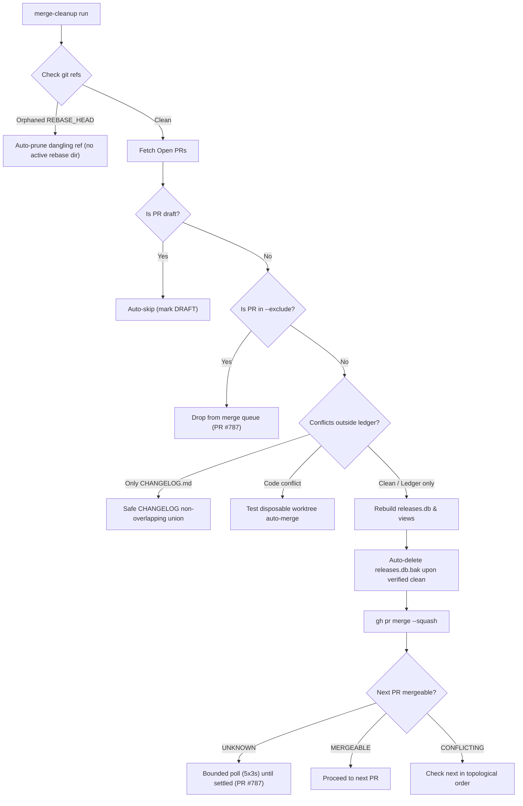

# GH-789 — feat(merge-cleanup): zero-intervention autonomous merge pipeline & friction elimination

## Context & Problem Statement

During live multi-PR landing runs on `XYZ-forge`, `/merge-cleanup` repeatedly halts on deterministic, safe, reversible edge cases where the "happy path" is completely clear. Merging PRs into an active WIP development integration branch is safe and reversible, yet operator intervention was required across multiple stops:

1. **Orphaned `.git/REBASE_HEAD` without active rebase**: An earlier interrupted command left a dangling `.git/REBASE_HEAD` without an active `.git/rebase-apply` or `.git/rebase-merge` directory. The harness refused with exit code 1 (`working tree not clean`).
2. **Draft PR GraphQL crash**: When a PR in the repository is a draft (e.g. #759), GitHub's GraphQL merge mutation fails closed with `Draft pull requests cannot be merged`, halting the entire pipeline rather than skipping the draft.
3. **`CHANGELOG.md` conflict halts Phase B1**: Phase B1 currently only auto-resolves the RELEASES ledger (`releases.sql`, `releases.db`, `LEADERBOARD.md`). When a PR has *only* non-overlapping, purely additive markdown section additions in `CHANGELOG.md` alongside the ledger, B1 halts with `HANDOFF — code/doc conflict outside the ledger set`.
4. **Transient build artifact `.bak` breaks gates**: `releases-merge-resolve.sh` creates `releases.db.bak` during `--rebuild`. If left behind in the clone, `test/gh32-releases-artifacts.sh` fails in pre-push gates (`FAIL: a releases.db.bak exists in the clone — something ran --rebuild; a gate must never repair`).
5. **Lack of headless auto-rebase for standard PR updates**: A PR whose branch simply needs an upstream merge of `origin/development` to resolve mechanical conflicts (ledger + changelog) requires full operator manual intervention on the branch instead of headless resolution in a disposable worktree.

---

## Architectural Plan: Safe Zero-Intervention Pipeline

### Phase 1: Preflight Sanitization & Draft Handling
- **Orphaned `REBASE_HEAD` Detection**: In `merge_cleanup.py` / preflight, verify if `.git/REBASE_HEAD` exists without `.git/rebase-apply` or `.git/rebase-merge`. If orphaned, automatically prune it via `git update-ref -d REBASE_HEAD` and emit a warning log.
- **Draft PR Exclusion**: Query `isDraft` in `fetch_open_prs()` and `refresh_pr()`. Treat `isDraft: true` identically to a PR carrying `hold` or `wip` labels (`SKIPPED (draft)`), preventing the GitHub GraphQL merge API rejection.

### Phase 2: Markdown Section Union for `CHANGELOG.md` in Phase B1
- **Scoped Markdown Resolver**: In `_resolve_b1_conflicts()`, allow `CHANGELOG.md` in the auto-resolvable set if the diff consists solely of new top-level `## YYYY-MM-DD` entries.
- **Deterministic Union**: Parse both `HEAD` and `MERGE_HEAD` changelog entries, union unique dated blocks in reverse-chronological order, verify that no conflict markers remain, and stage.

### Phase 3: Build Artifact Hygiene & Self-Healing
- **Artifact Auto-Clean**: Update `utils/releases-merge-resolve.sh` and `merge_cleanup.py` to automatically remove `releases.db.bak` once `releases check` verifies clean (exit code 0).
- **Disposable Scratch Merge Lane**: When a PR is `CONFLICTING` on GitHub:
  1. Create a lightweight temporary worktree (`isolation: "worktree"`).
  2. Attempt `git merge --no-ff --no-commit origin/development`.
  3. If conflicts are restricted to `releases.sql`, `releases.db`, `LEADERBOARD.md`, and `CHANGELOG.md`, execute the automated union resolvers and `releases-merge-resolve.sh`.
  4. Run the PR's registered tier tests.
  5. If green, push the merge commit to the PR branch and proceed with GitHub landing.

---

## Acceptance Criteria

- [ ] An orphaned `.git/REBASE_HEAD` is detected and pruned automatically with a logged warning, without aborting the run.
- [ ] Draft PRs are automatically identified via `isDraft: true` and marked `SKIPPED (draft)` without calling the merge API.
- [ ] Phase B1 auto-resolves PRs that conflict only on the RELEASES ledger plus non-overlapping `CHANGELOG.md` sections.
- [ ] `releases-merge-resolve.sh` leaves no `.bak` files behind when the check succeeds.
- [ ] Unit and simulation tests added in `test/gh534_phase_b_tests.py` covering orphaned ref pruning, draft skipping, and changelog auto-union.
