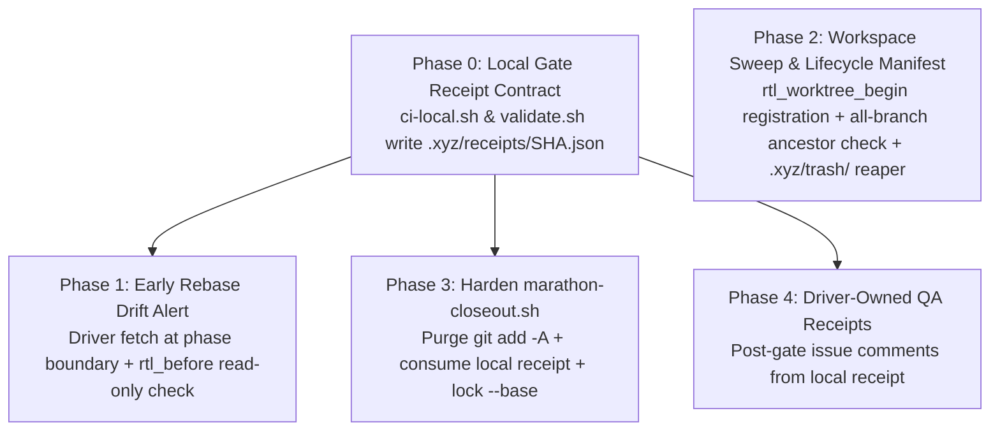

# GH-124: End-of-Day Closeout Automation & Lifecycle Hygiene (Plan)

## Status

| What was just completed | What's next |
|---|---|
| **Plan Finalized (2026-08-21):** Adjudicated across Ox-Alpha review, Agent2Agent #658731 consensus, and Fable 5 hardening. | Implement Phase 0 (Gate Receipt Contract) & Phase 1 (Drift Alert). |

---

## Canonical Implementation Specification (Finalized & Hardened Plan)

This document establishes the **authoritative, production-grade implementation specification and safety contracts** for eliminating end-of-day closeout friction, incorporating all feedback from the `openrouter/stealth/ox-alpha` relay review, Agent2Agent session [#658731](https://github.com/HiQS-Labs/XYZ-forge/issues/124#issuecomment-5373503236), and Fable 5's architectural verification.

---

### Core Operating Principles & Invariants

1. **Guilty-Until-Proven-Pushed (Zero Data Loss across all refs):**
   - **Worktrees:** Must verify `git merge-base --is-ancestor HEAD origin/<branch>`.
   - **Full Clones:** Must verify that **every** local branch in the clone is pushed (`git for-each-ref refs/heads/` ancestor check) AND `git stash list` is empty.
2. **Soft-Quarantine with Automated Reaper:** Untracked/ignored contents (`.relay-scratch/`) and swept full clones are moved into `.xyz/trash/<timestamp>-<name>/`. Each sweep run automatically reaps trash directories older than 72h (`find .xyz/trash/ -mtime +3 -delete`); immediate hard purge is available via `--purge-trash`.
3. **Strictly Read-Only In-Turn Hooks + Designated Inter-Phase Fetch:** Turn shims (`rtl_before()`) never call `git fetch`. The outer driver (`marathon_drive.py` / `relay_drive.py`) owns the single serialized `git fetch --no-tags --quiet origin development` at **startup** and **inter-phase boundaries**, ensuring local tracking refs stay fresh without mid-turn lock contention.
4. **On-Disk Local Gate Receipt Contract:** `ci-local.sh` and `validate.sh` write a machine-checkable receipt artifact to `.xyz/receipts/<SHA>.json` upon green exit. Auto-PR consumes this deterministic local file before opening PRs.
5. **Registered Workspace Lifecycle:** `rtl_worktree_begin` and clone creation tools write entries into `.xyz/workspaces.json`. Sweep bounds itself to this manifest and safely cross-checks `git worktree list --porcelain`.
6. **Single Source of Truth (No Duplicate Twins):** Reject creating `utils/py/closeout.py`; harden the existing `relay-automation/marathon-closeout.sh` path directly.
7. **Preserve Shared Tooling Schemas:** Issue titles are immutable across the automation lifecycle (no title mutations). QA attestation is emitted via post-gate structured issue comments with machine-checkable test receipts.

---

### Phased Implementation Roadmap



---

### Phase 0: Local Gate Receipt Contract (Prerequisite for PR & QA)
- **Location:** `ci-local.sh` and `validate.sh`
- **Specification:** When a test suite passes (exit 0), write an on-disk JSON receipt:
  - **Path:** `.xyz/receipts/<HEAD_SHA>.json`
  - **Schema:**
    ```json
    {
      "sha": "<HEAD_COMMIT_SHA>",
      "gate": "ci-local.sh",
      "mode": "sequential",
      "exit_code": 0,
      "passed": 230,
      "total": 230,
      "timestamp": "2026-08-21T18:00:00Z"
    }
    ```
- **Durability:** Committed into evidence or preserved under `.xyz/` so downstream consumers (`marathon-closeout.sh`, issue commenter) read an authoritative local proof of qualification.

---

### Phase 1: Early Rebase Drift Alert (`QW4` — Driver-Refreshed Local Cache)
- **Designated Fetch Point:** The outer driver (`marathon_drive.py` / `relay_drive.py`) runs a single serialized background fetch at startup and **between phase handoffs**:
  ```bash
  GIT_OPTIONAL_LOCKS=0 timeout 5s git fetch --no-tags --quiet origin development 2>/dev/null || true
  ```
- **In-Turn Check (`rtl_before` in `relay-turn-lib.sh`):** Strictly read-only, non-network comparison:
  ```bash
  local drift_count
  drift_count="$(git rev-list --count HEAD..refs/remotes/origin/development 2>/dev/null || echo 0)"
  if [ "$drift_count" -ge 3 ]; then
    echo "⚠️  NOTICE: tracking ref origin/development is $drift_count commits ahead. Consider rebasing between phases."
  fi
  ```

---

### Phase 2: Ephemeral Workspace Garbage Collector & Lifecycle Manifest (`QW3`)
- **Registration Point:**
  - `rtl_worktree_begin()` (in `relay-turn-lib.sh`) and clone creation helpers append newly created workspaces to `.xyz/workspaces.json` (`{path, type, branch, created_at, pid}`).
- **Location:** `utils/harness/workspace-sweep.sh` (and `xyz workspace sweep`)
- **Safety Predicate Chain:**
  1. **Candidate Resolution:** Evaluates entries in `.xyz/workspaces.json` and registered `git worktree list --porcelain`.
  2. **Canonical Path Refusals:** Hard refusal if target resolves to primary repo root, active CWD, a symlink, or an unmanaged parent directory.
  3. **Porcelain Cleanliness:** `[ -z "$(git -C "$p" status --porcelain)" ]` (zero uncommitted tracked changes).
  4. **Multi-Branch & Stash Verification (Full Clones):**
     ```bash
     # Check ALL local branches are pushed to remote
     for ref in $(git -C "$p" for-each-ref --format='%(refname:short)' refs/heads/); do
       git -C "$p" merge-base --is-ancestor "$ref" "origin/$ref" || die "Unpushed branch $ref in clone $p"
     done
     # Check no stashes exist
     [ -z "$(git -C "$p" stash list)" ] || die "Unsaved git stash in clone $p"
     ```
  5. **Ignored-Content Quarantine & Deletion:**
     - Archives untracked/ignored files (`.relay-scratch/`) to `.xyz/trash/$(date +%Y%m%d-%H%M%S)-$(basename "$p")/`.
     - **Linked Worktree:** Runs `git worktree remove "$p"` from primary repo context.
     - **Full Clone:** Moves directory into `.xyz/trash/`.
  6. **Automated Trash Reaper:** Automatically purges `.xyz/trash/` entries older than 72 hours on every sweep run; explicit purge via `--purge-trash`.

---

### Phase 3: One-Shot PR Scaffold (`QW2` — Hardened Existing Path)
- **Location:** `relay-automation/marathon-closeout.sh` (invoked via `marathon_drive.py --open-only --no-commit`)
- **Reject Duplicate Twin:** No `utils/py/closeout.py`.
- **Hardening Enhancements:**
  1. **Purge `git add -A`:** Remove indiscriminate `git add -A` sweep in `marathon-closeout.sh` that sweeps unintended untracked files.
  2. **Hard-Lock Base:** Strictly enforce `--base development` by default with validation against `main`.
  3. **Deterministic Local Receipt Check:** Asserts that `.xyz/receipts/<HEAD_SHA>.json` exists, is valid JSON, and has `exit_code: 0` before executing `gh pr create`.
  4. **Interface:** Defaults to `--dry-run`; `--execute` runs `git push origin "$branch"` and `gh pr create`.

---

### Phase 4: Continuous In-Flight QA Attestation (`QW1` — Driver-Owned, Post-Gate)
- **Location:** `utils/py/marathon_drive.py` (and `utils/py/relay_drive.py`)
- **Timing:** Emitted **post-gate** after the pre-advance gate succeeds and `.xyz/receipts/<SHA>.json` is written.
- **Behavior:** Reads the local receipt and emits a structured comment to the tracked issue:
  ```markdown
  ### Phase QA Attestation: Phase <id> Approved ✅
  <!-- xyz-qa-receipt: issue=<n> phase=<id> sha=<sha> -->
  - **Reviewer:** <Model ID> (<Harness>)
  - **Evidence Receipt:** `gate: ci-local.sh @ <SHA> -> PASS (230/230 in <dur>s)`
  - **Artifacts:** <List of modified files>
  ```
- **Idempotency & Non-Fatal Wrapping:** Checks issue for the HTML marker before posting; wrapped in non-fatal error handling so `gh` API rate limits or offline state never fail a green phase.
