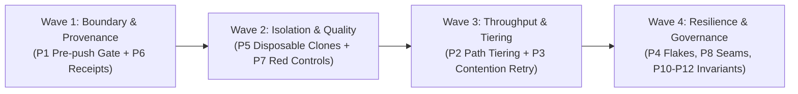

# ci-optimize — Transferable CI/CD Architecture & Audit Playbook

Distilled from real production failure modes across thousands of automated agent and
developer runs (#35, #42/#376, #365, #528, #544, #558, #549, #564). Every rule states
the **mechanism**, the **failure it prevents**, and the **audit check** to verify compliance.

Nothing here requires a paid tier, a dedicated runner vendor, or speculative subsystems.

---

## The 12 Foundational Principles

### 1. Gate at the Push Boundary, Not the Commit
* **Mechanism:** Local commits remain unblocked, fast, and offline-friendly. The pre-push hook runs the qualifying gate; hosted CI independently attests after push. Bypasses (e.g. `--no-verify` or explicit skip flags) are logged to auditable telemetry, never silent. The hook is installed via an idempotent script and verified with an automated check.
* **Prevents:** Broken `main`/`development` integration branches and the gradual cultural decay into "CI is advisory."
* **Audit Check:** Does `git push` trigger local checks? Does a fresh clone provide an automated command to install/verify hooks? Are bypasses logged and traceable?

### 2. Tier Tests by Subsystem and Fail Closed
* **Mechanism:** A routing script inspects changed file paths and maps them to minimal targeted test tiers (e.g., documentation edits run only doc-hygiene checks; scoped module edits run module suites). Any unrecognized or unmapped path automatically runs the **full suite** ("unknown → full").
* **Prevents:** Long, wasteful CI cycles for trivial edits, without risking blind spots when new directories or files are added.
* **Audit Check:** Is the path-to-test mapping committed and maintained beside the tests? Does modifying an unmapped file fail closed to the full suite?

### 3. Run in Parallel, but Let Only a Re-run Flip a Verdict
* **Mechanism:** Execute suites in parallel by default to maximize throughput. If a suite fails during a parallel run, immediately re-run it in isolated serial execution. If it passes in isolation, report the suite as **contended** in the gate summary while preserving the original run receipt. Projects with safety-critical invariants may still choose to fail closed on contention.
* **Prevents:** The anti-pattern of blindly re-running entire pipelines until green, while surfacing resource contention for remediation instead of hiding it.
* **Audit Check:** Can test suites run concurrently? Does a parallel failure trigger an isolated retry that explicitly names resource contention?

### 4. Never Attribute a Flake Without a Controlled Baseline
* **Mechanism:** When a suite fails intermittently on a branch, execute matched, bounded control batches (minimum 20–25 runs each) on both the `branch` and `base` commits under identical concurrency and machine conditions. Compare failure rates and error signatures. The evidence is consistent with a pre-existing flake **only if** both error signatures and failure rates match the baseline; novel error signatures or statistically elevated branch failure rates remain blocking branch defects.
* **Prevents:** Wasting engineering cycles fixing defects that were not introduced by the PR, while preventing genuine regressions from slipping through under the guise of "known flakes."
* **Audit Check:** Is there a standard, reproducible attribution procedure comparing matched branch vs base sample batches and error signatures?

### 5. Mutation-Heavy Suites Run in a Disposable Full Clone
* **Mechanism:** Suites that mutate databases, write configuration, rewrite generated files, or manipulate git refs must run in a temporary, disposable full clone (e.g. under `/tmp/`), never in the primary working tree and **never in a linked git worktree** (linked worktrees share `.git/config`, hooks, remotes, and ref locks with the parent). Inspect clone identity before and after execution: snapshot and compare HEAD commit SHA, local git config, configured remotes, local refs with object IDs (`git show-ref`), and working tree cleanliness.
* **Prevents:** Corrupting the developer's working directory, stomping peer work, and emitting false gate receipts from dirty or drifted state.
* **Audit Check:** Do integration suites execute in isolated disposable full checkouts? Are parent git configs, refs, and working trees verified unchanged before and after?

### 6. Keep a Receipt with Every Gate Result
* **Mechanism:** Every local and CI gate run emits a structured, machine-readable receipt (e.g. JSONL) containing: commit SHA, command line, exit code, test tally, environment fingerprints, start/end timestamps, and log pointers. Compressed raw logs are archived alongside the receipt.
* **Prevents:** Unverifiable "it was green when I pushed" claims and missing post-incident forensics.
* **Audit Check:** Are test run receipts structured, machine-readable, and committed or attached as durable artifacts to the reviewed revision?

### 7. Every New Test Gets a Red Control with Contained Mutation & Fixture Guards
* **Mechanism:** A test proves nothing until observed failing under a controlled mutation. Execute the red control against a disposable copy or via injected faults. Verify that the mutation actually landed (e.g. grep the modified copy), assert that the failure produces the expected non-zero code, and clean up. Guard all input fixtures by asserting paths are non-empty, expected file types exist, and extracted content is non-zero before running assertions.
* **Prevents:** Vacuously passing tests, empty string comparisons passing silently, or test suites remaining green even after the underlying feature is removed.
* **Audit Check:** Does the test harness verify that assertions fail when the guarded condition is broken? Are fixture extractions guarded against 0-byte outputs?

### 8. Test Seams are Explicit and Tests Pin Every Seam
* **Mechanism:** External dependencies, CLI binary paths, configuration files, and database endpoints are defined via explicit, injectable seams (e.g. environment variables or dependency injection). Test harnesses pin every seam to isolated mock fixtures, overriding host environment defaults.
* **Prevents:** "Works on my machine" failures caused by tests reading the operator's real `~/.config`, user keys, or ambient local daemons.
* **Audit Check:** Does the test suite run cleanly in an empty environment with zero reads from user-local home configuration?

### 9. Hosted CI Strategy is Risk-Calibrated and Budget-Aware
* **Mechanism:** Hosted pull-request CI focuses on fast, blocking verification aligned with the repository's risk profile. Full platform matrices and expensive end-to-end suites are triggered at the release or promotion boundary. Advisory platform canaries report portability signals without blocking PR merges unless mandated by platform tier contracts.
* **Prevents:** Overloaded CI queues paralyzing PR velocity and false-positive canary failures blocking urgent, unrelated fixes.
* **Audit Check:** Is PR feedback optimized for rapid turnaround? Are expensive multi-platform matrix builds placed at appropriate promotion boundaries?

### 10. Guard Ported Components with Twin Freeze and Contract Tests
* **Mechanism:** When porting a tool or subsystem (e.g. Bash → Python or JS → Rust), declare the modern implementation as authoritative, freeze the legacy fallback, and guard both with shared contract tests. Reject undeclared modifications to frozen legacy files in CI unless an explicit exception declaration is provided.
* **Prevents:** Dual-implementation drift where fixes applied to one implementation leave the fallback subtly broken or diverged.
* **Audit Check:** Are legacy and modern entrypoints guarded by contract tests? Does CI enforce freeze boundaries on ported legacy files?

### 11. Contention Has an Owner: Shared Resources Resolve Through One Authority
* **Mechanism:** A single canonical resolver function determines resource lock paths, socket bindings, and storage locations across all operational modes (clone, linked worktree, vendored). All languages and runner shims consume identical lock resolution logic verified by cross-language contract tests.
* **Prevents:** Race conditions and lock collisions where concurrent processes believe they hold exclusive locks.
* **Audit Check:** Is lock/resource path resolution centralized in one canonical utility rather than re-implemented in multiple scripts?

### 12. Explicitly Disclose What the Gate/Reviewer Did Not Sweep
* **Mechanism:** Automated gates and review bots must explicitly state uninspected scopes, skipped directories, and unexecuted test tiers (e.g., `coverage_swept: false`, `untested_subsystems: [billing]`). Automated review rounds are strictly capped; upon reaching the cap, escalate to human adjudication rather than manufacturing synthetic approvals.
* **Prevents:** "Review theatre" where a green checkmark gives a false sense of security over uninspected code.
* **Audit Check:** Do automated test and review reports clearly disclose exclusions, skipped tiers, and boundary limitations?

---

## Anti-Patterns: What to Skip

When optimizing CI/CD, avoid these high-overhead, low-return traps:
1. **Custom hermetic runner sandboxes:** Adds high operational maintenance compared to disposable container/clone scripts.
2. **Complex caching layers:** Caches that frequently invalidate or mask dependency drift introduce intermittent failures.
3. **Paid test-retry SaaS:** Do not invest in flake-retry services until Principles 1, 4, 5, and 8 are resolved.
4. **Merge queues before the local gate is trusted:** Merge queues become massive bottlenecks if unverified commits reach the queue.
5. **Parallel shadow test frameworks:** Never build a secondary test runner when extending the existing harness satisfies the requirement.

---

## Phased Adoption Roadmap

Adopt these principles in 4 structured waves to maximize reliability while minimizing transition risk:

1. **Wave 1 — Boundary & Provenance (P1, P6):** Wire an idempotent pre-push gate and emit structured JSONL run receipts. Stops broken code at the author boundary with verifiable evidence.
2. **Wave 2 — Isolation & Test Quality (P5, P7):** Isolate mutation-heavy suites in disposable full clones and add mutation controls with non-empty fixture guards.
3. **Wave 3 — Throughput & Routing (P2, P3):** Introduce path-based subsystem test tiering with fail-closed defaults, and parallelize test suites with isolated contention retry reporting.
4. **Wave 4 — Resilience & Governance (P4, P8, P9, P10, P11, P12):** Pin test seams, implement flake baseline attribution, calibrate hosted CI boundaries, freeze ported twins, centralize lock resolution, and enforce explicit scope disclosure.

---

## CI/CD Audit Scorecard & Rubric

Evaluate a repository against each standard (0 = Absent, 1 = Partial / Ad-hoc, 2 = Fully Enforced & Automated).

| # | Audit Dimension | Target Standard | Scoring Criteria (0–2) | Evidence / Artifact |
|---|---|---|---|---|
| 1 | **Gate Boundary** | Pre-push gate active | 2: Automated hook verification 1: Manual script 0: None | Hook installer & check script |
| 2 | **Tiering** | Subsystem path-mapped suites | 2: Path map committed, fails closed 1: Ad-hoc filters 0: Monolithic gate | Routing script & route test |
| 3 | **Contention** | Parallel run + isolated retry | 2: Parallel default, retries report contention 1: Parallel only 0: Serial only | Gate runner configuration |
| 4 | **Flake Policy** | Matched baseline comparison | 2: 20+ runs on both branch & base with signature matching 1: Single-side re-runs 0: Blind retry | Attribution script / PR report |
| 5 | **Isolation** | Disposable clone for mutation | 2: Throwaway full clone with pre/post HEAD, config, remotes, refs & dirty check 1: Partial cleanup 0: In-place mutation | Test execution harness & diff logs |
| 6 | **Provenance** | Structured run receipts | 2: Machine-readable JSONL + logs 1: Raw log only 0: Unrecorded | JSONL receipts / artifacts |
| 7 | **Test Quality** | Contained red controls & guards | 2: Mutation verification + fixture guards 1: Fixture checks only 0: Unverified | Test suite mutation tests |
| 8 | **Seams** | Injectable, pinned test seams | 2: All seams pinned to fixtures 1: Partial env vars 0: Host configs read | Harness mock configs |
| 9 | **Hosted CI** | Risk-calibrated smoke & matrix | 2: Fast PR smoke, matrix at promotion 1: Long PR matrix 0: Unstructured | CI workflow definition |
| 10 | **Parity** | Twin freeze & contract tests | 2: Automated twin guard + contracts 1: Manual review 0: Unmonitored drift | CI parity guard checks |
| 11 | **Locking** | Single canonical lock resolver | 2: Central resolver across all modes 1: Ad-hoc lock files 0: No locking | Lock resolver library |
| 12 | **Disclosure** | Explicit gap & scope disclosure | 2: Automated reports cite uninspected scope 1: Manual notes 0: Silent omissions | Gate & review summary reports |

### Scoring Assessment
* **20–24 Points (A - Resilient):** Production-grade CI/CD with robust isolation, fast feedback loops, and zero false confidence.
* **14–19 Points (B - Solid):** Functional pipeline with minor contention or isolation gaps; prioritize Wave 2 & 3 improvements.
* **<14 Points (C - High Risk):** Fragile pipeline prone to false greens, flaky builds, or workspace corruption; adopt Wave 1 immediately.
