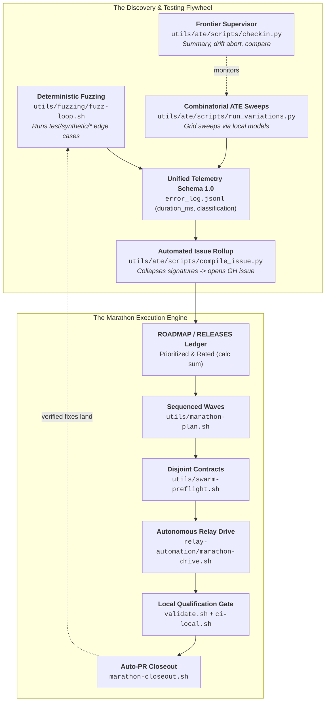

# `utils/` — Subsystems, Tooling & The Discovery Flywheel

This directory houses the operational toolchain, diagnostic CLIs, and autonomous testing engines for **XYZ-forge**.

---

## 1. Autonomous Fuzzing & ATE Discovery Flywheel

The primary testing engines in `utils/` operate as an autonomous discovery flywheel that generates synthetic and combinatorial stress, detects latent edge cases, and feeds reproducible defect contracts into the Marathon execution engine:



---

### A. Deterministic Synthetic Fuzzing (`utils/fuzzing/`)

* **Primary Script:** [`utils/fuzzing/fuzz-loop.sh`](fuzzing/fuzz-loop.sh)
* **Purpose:** Rapidly executes every synthetic boundary test in `test/synthetic/` (testing containment invariants, script serialization, worktree isolation, parameter leaks, and programmatic tool execution).
* **Telemetry Output:** Emits structured JSONL matching `schema_version: "1.0"`.

```bash
# Run full synthetic fuzz loop and capture telemetry
FUZZ_LOG="/tmp/fuzz-telemetry.jsonl"
bash utils/fuzzing/fuzz-loop.sh --jsonl "$FUZZ_LOG"

# Inspect results using universal inspector
python3 utils/ate/scripts/checkin.py --log "$FUZZ_LOG"
```

---

### B. Autonomous Tournament & Variation Sweeps (`utils/ate/`)

* **Primary Scripts:**
  * [`utils/ate/scripts/run_variations.py`](ate/scripts/run_variations.py): Parameterized grid runner.
  * [`utils/ate/scripts/checkin.py`](ate/scripts/checkin.py): Universal inspector and supervisor monitor.
  * [`utils/ate/scripts/compile_issue.py`](ate/scripts/compile_issue.py): Deduplicating GitHub issue compiler.
* **Purpose:** Runs long-horizon (2–4hr+) unattended combinatorial sweeps across model providers, CLI flags, prompt densities, and tool modes using a fast zero-cost local model (e.g. Gemma 4 in LM Studio / Ollama) as the worker.
* **Supervision:** A frontier model checks in periodically via `checkin.py` to inspect latency distributions and abort runs on repetitive drift.
* **Issue Rollup:** When the sweep completes, `compile_issue.py` automatically collapses near-duplicate failure signatures (`category :: likely_cause`) into a single severity-ranked checklist (`CRITICAL` → `HIGH` → `MEDIUM` → `LOW`) and opens a unified GitHub issue.

```bash
# Execute combinatorial variation sweep
python3 utils/ate/scripts/run_variations.py \
  --repo /tmp/scratch-repo \
  --variations utils/ate/variations.tool-density.yaml \
  --lmstudio-model "gemma-4-31b-instruct" \
  --gh-repo HiQS-Suite/XYZ-forge \
  --test-name "tool-density-fuzz" \
  --minutes 180

# Frontier supervisor check-in (run every ~5 min)
python3 utils/ate/scripts/checkin.py --log error_log.jsonl --tail 20

# Compare two benchmark runs
python3 utils/ate/scripts/checkin.py --compare baseline.jsonl candidate.jsonl
```

---

### C. Unified Telemetry Schema 1.0 Contract

Both `utils/fuzzing/` and `utils/ate/` emit newline-delimited JSON (`JSONL`) adhering to `schema_version: "1.0"`:

```json
{
  "schema_version": "1.0",
  "run_id": "20260821210915_gh102-telemetry-schema.sh",
  "timestamp": "2026-08-22T04:09:15Z",
  "engine": "fuzz_loop",
  "status": "pass",
  "exit_code": 0,
  "duration_ms": 455,
  "turn_count": null,
  "prompt_tokens": null,
  "completion_tokens": null,
  "total_tokens": null,
  "tokens_source": "unsupported",
  "classification": {
    "status": "pass",
    "severity": "none",
    "category": "deterministic_synthetic_fuzz",
    "likely_cause": null
  }
}
```

---

## 2. Subsystem Directory Index

| Subdirectory | Description |
|---|---|
| [`utils/py/`](py/) | **Authoritative Python Twin Runtimes:** Authoritative implementations for Tier-A entry points (`marathon_drive.py`, `relay_drive.py`, `agy-turn.py`, `consult.py`, `releases_app.py`, `review_xyz.py`, `workspace_manager.py`, `script_runner.py`, `gate_receipt.py`). |
| [`utils/hq/`](hq/) | **Multi-Repo Command Center:** CLI (`hq.sh`) driving multi-repo resolution, PDDA cross-repo task landing, and `/hq` skill execution. |
| [`utils/pdda/`](pdda/) | **PDDA Governance & Hygiene:** Doc lifecycle validation (`pdda.sh`), link checks, roadmap-to-working sync, and doc invariant enforcement (`pdda-local-checks.sh`). |
| [`utils/timeline/`](timeline/) | **Interactive Ledger Viewer:** Exporter (`export_timeline.py`) projecting SQLite `releases.db` into liquid HTML timeline views (`RELEASES.html`, `RELEASES-PREVIEW.html`). |
| [`utils/telemetry/`](telemetry/) | **Telemetry & Receipts:** Telemetry collector adapters, cost summary collectors, and test evidence recorders. |
| [`utils/swe-diagram/`](swe-diagram/) | **SWE Architecture Diagrams:** Automated diagram generator mapping repository workflows and kernel states. |
| [`utils/vndr/`](vndr/) | **Vendored Assets & Tools:** Vendoring tools and third-party scripts. |

---

## 3. Core Script Index

### Marathon & Relay Automation
* [`marathon-plan.sh`](marathon-plan.sh) / `utils/py/marathon_plan.py`: Computes prioritized marathon queues from `ROADMAP.md`, evaluates freshness/drift, checks write-set collisions, and batches lanes into disjoint waves.
* [`swarm-preflight.sh`](swarm-preflight.sh) / `utils/py/swarm_preflight.py`: Preflight contract validator checking freshness, branch naming, write allowlists (`ALLOW_PATHS`), test oracles, and frozen twin integrity before firing a lane.
* [`release-lanes.sh`](release-lanes.sh): Evaluates active release manifest membership, dialed-in lane states, and ship gates.

### Release Ledger & Database
* [`releases-merge-resolve.sh`](releases-merge-resolve.sh): One-command 3-way conflict resolver for `releases.sql` SQLite dumps.
* [`roadmap-dashboard.sh`](roadmap-dashboard.sh) & [`leaderboard.sh`](leaderboard.sh): Visualizes ledger queues, calculates `rated N/N/N/N` calc sums, and prints prioritized task leaderboards.

### Quality, CI Routing & Auditing
* [`ci-route.sh`](ci-route.sh): 3-tier test suite routing engine (`docs`, `utility`, `core`) and CPU throttling governor consumed by `validate.sh` and `githooks/pre-push`.
* [`gate-record.sh`](gate-record.sh) & [`gate-status.sh`](gate-status.sh): Inspects and verifies committed on-disk gate qualification receipts.
* [`validate-agy.sh`](validate-agy.sh): Verifies local Google Antigravity CLI installation, reachability, and auth state.
* [`transcript-audit.sh`](transcript-audit.sh): Scans agent conversation logs for containment leaks, off-lane writes, or unhandled tool exceptions.
* [`signal-triage.sh`](signal-triage.sh): Triages event stream signals and actor handoffs in `.tick/events/`.
* [`checkjs.sh`](checkjs.sh): Fast syntax and type validator for Node kernel files.
